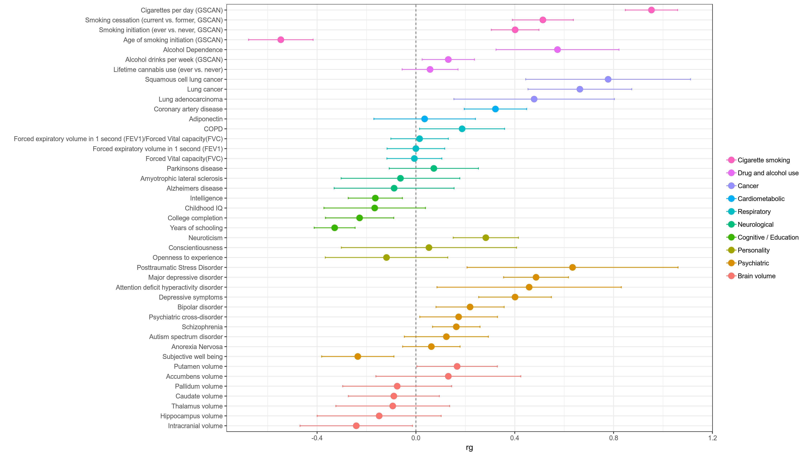

# LD-Regression Workflow 
Documentation for running ld-score regression between GWAS summary statistics from a reference phenotype and set of phenotypes of interest. 

### Pre-requisites 
   * Unix-based operating system (Linux or OSx. Sorry Windows folks.)
   * Java v1.8 and higher [(download here)](https://www.oracle.com/technetwork/java/javase/downloads/jdk8-downloads-2133151.html)
   * [Docker](https://docs.docker.com/install/)
   * [AWS CLI](https://docs.aws.amazon.com/cli/latest/userguide/cli-chap-install.html)
   
   1. Install [Cromwell](https://cromwell.readthedocs.io/en/stable/tutorials/FiveMinuteIntro/) if you haven't already
   
   2. [Configure the AWS CLI](https://docs.aws.amazon.com/cli/latest/userguide/cli-chap-configure.html) for use with CODE AWS group. 
        * Configure with the secret key associated with the CODE AWS account 
   
   3. Clone local copy of ld-regression-pipeline to download this repository to your local machine
        
        ```
        git clone https://github.com/RTIInternational/ld-regression-pipeline.git    
        ```
        
   Voila! You're ready to get started running the pipeline.
   
   More detailed running instructions for WDL/Cromwell workflows are found in the tutorial for the metaxcan pipeline [here](https://github.com/RTIInternational/metaxcan-pipeline) 

## Workflow overview
[LD-Hub](http://ldsc.broadinstitute.org/ldhub/) and the associated [LDSC](https://github.com/bulik/ldsc) software package provides a suite of tools designed to perform LD-score regression between GWAS outputs of two phenotypes.

This document describes an automated WDL workflow designed to perform LD regression of a reference phenotype against one or more phenotypes using the following high level steps:

1) Transform GWAS summary statistics into [summary statistics format](https://github.com/bulik/ldsc/wiki/Summary-Statistics-File-Format)
2) Reformat summary statistics using `munge_sumstats.py`
3) Perform LD-regression between the reference and all traits of interest using `ldsc.py`
4) Combine results and plot in a single graph (below)

<div align=center></div>

### Workflow inputs
The following are required for the main phenotype and each phenotype you want to compare using ld-regression:
1) Phenotype name
2) Plot label for how you want the phenotype to be labeled on the output graph
3) path to a GWAS summary statistics output file
4) 1-based column index for each of the following in the GWAS input file:
    * id col
    * chr col
    * pos col
    * effect allele col
    * ref allele col 
    * pvalue col
    * Effect column (e.g. beta, z-score, odds ratio)
    * Either the number of samples in the cohort or the sample size column index in the GWAS input
5) Effect column type in the GWAS file (BETA, Z, OR, LOG_ODD)
6) Plot group for grouping phenotypes into larger trait groups on final output plot

### Detailed Workflow Steps
1) Transform GWAS in summary statistics
    * Split by chr if necessary
        * Put columns in standardized order and give standard colnames (e.g. SNP, A1, A2, BETA, etc.)
        * Convert to 1000g ids
        * Replace 1000g ids with only rsIDs
2) Reformat summary statistics using `munge_sumstats.py`
    * For each chr:
        * Call munge_sumstats.py
        * Remove empty variants for each chromosome
    * Re-combine into single munged sumstats file
3) Perform LD-regression between the reference and all traits of interest using `ldsc.py`
    * For each phenotype you want to regress against reference phenotype
        * untar ld reference panel files
        * Call `LDSC.py` with `--rg` option to get logfile with regression statistics
4) Combine results and plot in a single graph
    * Parse statistics from log files generated by LDSC
    * Combine into single table and add plot information (e.g. plot_label, plot_group)
    * Make plot of rg values returned for each phenotype with 95% CI error bars
   
## Creating your input file
This repo provides a custom docker tool designed to help generate the json-input file needed to run the pipeline. 
To generate your analysis-ready input you need to:
1. Fill out your workflow template file
2. Create a pheno info excel spreadsheet containing info about phenotypes you want to compare
3. Use generate_ld_regression_input_json.py tool to create your final input file

### Fill out your workflow template file
Start with the json_input/full_ld_regression_wf_template.json and fill in the following values unique to your analysis:
1) Give your analysis a name

        "full_ld_regression_wf.analysis_name": "ftnd_test"
        
        
2) Specify paths to GWAS summary files (22 in total; 1 per chr) for your main reference trait you wish to compare to other phenotypes

        "full_ld_regression_wf.ref_sumstats_files": 
        [
        "s3://rti-nd/META/1df/boneyard/20181108/results/ea/20181108_ftnd_meta_analysis_wave3.eur.chr1.exclude_singletons.1df.gz",
        "s3://rti-nd/META/1df/boneyard/20181108/results/ea/20181108_ftnd_meta_analysis_wave3.eur.chr2.exclude_singletons.1df.gz",
        ...
        "s3://rti-nd/META/1df/boneyard/20181108/results/ea/20181108_ftnd_meta_analysis_wave3.eur.chr22.exclude_singletons.1df.gz",
        ]
3) Inspect your GWAS summary files to find the correct indices for each required column index (1-based so the first column has index 1)
        
        "full_ld_regression_wf.ref_trait_name" : "ftnd",
        "full_ld_regression_wf.ref_id_col":     1,
        "full_ld_regression_wf.ref_chr_col":    2,
        "full_ld_regression_wf.ref_pos_col":    3,
        "full_ld_regression_wf.ref_a1_col":     5,
        "full_ld_regression_wf.ref_a2_col":     4,
        "full_ld_regression_wf.ref_beta_col":   6,
        "full_ld_regression_wf.ref_pvalue_col": 8,
        
4) If your GWAS summary stats file has a sample size column, specify it's index

        "full_ld_regression_wf.ref_num_samples_col": 11 
        
5) Otherwise, provide the number of samples in the cohort (will be the same for all SNPs) 

        "full_ld_regression_wf.ref_num_samples" : 45233
6) Specify the effect type and the zero value as you would pass it to `munge_sumstats.py`
    
        "full_ld_regression_wf.ref_signed_sumstats" : "BETA,0"
        
7) Provide paths to the reference ld-reference panel bz2 tarball passed to `LDSC.py` 
        "full_ld_regression_wf.ref_ld_chr_tarfile": "s3://clustername--files/eur_w_ld_chr.tar.bz2",

8) Provide path to a merge_allele snplist needed for `munge_sumstats.py`

        "full_ld_regression_wf.merge_allele_snplist": "s3://clustername--files/w_hm3.snplist",

### Create a pheno info excel spreadsheet
Example pheno input file [here](doc/ftnd_ldsc_phenotypes_local.xlsx)

The pheno info excel spreadsheet contains information for each phenotype to compare per row. 

The format requires the following column names (explanation in parentheses):
1. **trait** (Trait Name)
2. **plot_label** (Label to be used on plots)
3. **sumstats_path** (Path to GWAS summary stats file)
4. **category** (Group label for plotting)
5. **sample_size** (GWAS sample size)
6. **effect_type** (Effect type; accepts Beta, Z, OR, log_odd)
7. **w_ld_chr** (Path to LD reference tarball to be used for `LDSC.py`)
8. **id_col** (1-based column index of snp id in GWAS sumstats file)
9. **chr_col** (chr column index) 
10. **pos_col** (position index)
11. **a1_col** (effect allele index)
12. **a2_col** (ref allele index)
13. **effect_col** (effect score index)
14. **pvalue_col** (pvalue index)
15. **sample_size_col** (sample size column index if present)
    
Note: All phenotypes must have either sample_size or sample_size_col but do not need to have both. 

### Use generate_ld_regression_input_json.py to create final input file
    
Create a folder that contains the input template and your phenotype file
    
    mkdir /path/to/workflow_inputs
    cp json_input/full_ld_regression_wf_template.json workflow_inputs
    cp phenotype_file.xlsx workflow inputs
    
Run inside docker image to produce final input file (Note: output gets printed to stdout)
    
    docker run -v "/path/to/workflow_inputs:/data/" rticode/generate_ld_regression_input_json \
        --json-input /data/full_ld_regression_wf_template.json \
        --pheno-file /data/phenotype_file.xlsx > /data/final_wf_inputs.json
        
Now the analysis-ready input file is ready to run and will be located at `/path/to/workflow_inputs/final_wf_inputs.json`

## Running an analysis
First, make a zip file of the git repo you cloned so Cromwell can handle the local WDL imports:
    
  
    # Change to directory immediately above metaxcan-pipeline repo
    cd /path/to/ld-regression-pipeline
    cd ..
    # Make zipped copy of repo somewhere
    zip --exclude=*var/* --exclude=*.git/* -r /path/to/workflow_inputs/ld-regression-pipeline.zip ld-regression-pipeline

Now run either via command line:

    java -Dconfig.file=/path/to/aws.conf -jar cromwell-36.jar run \
        workflow/plot_ld_regression_wf.wdl \
        -i /path/to/workflow_inputs/final_wf_inputs.json \
        -p /path/to/workflow_inputs/ld-regression-pipeline.zip
        
Or via an API call to a Cromwell server on AWS:

    curl -X POST "http://localhost:8000/api/workflows/v1" -H "accept: application/json" \
	-F "workflowSource=@/full/path/to/workflow/full_ld_regression_wf.wdl" \
	-F "workflowInputs=@"/path/to/workflow_inputs/final_wf_inputs.json \
	-F "workflowDependencies"=@/path/to/workflow_inputs/ld-regression-pipeline.zip
	

## Description of subworkflows
There are a number of workflows if you're interested in running only part of the pipeline manually:
* ldsc_preprocessing_wf.wdl: run the pipeline but stop after `munge_sumstats.py`
* munge_phenotype_sumstats_wf.wdl: run a single GWAS sumstats file through the `munge_sumstats.py` pipeline
* munge_sumstats_wf.wdl: run a single GWAS sumstats file that has already been split by chr through the `munge_sumstats.py` pipeline
* plot_ld_regression_wf.wdl: Merge and plot results from one or more ld-regression analyses
* single_ld_regression_wf.wdl: Run LD-regression only of the ref trait against a single trait 
    
        
## Authors
For any questions, comments, concerns, or bugs,
send me an email or slack and I'll be happy to help. 
* [Alex Waldrop](https://github.com/alexwaldrop) (awaldrop@rti.org)
